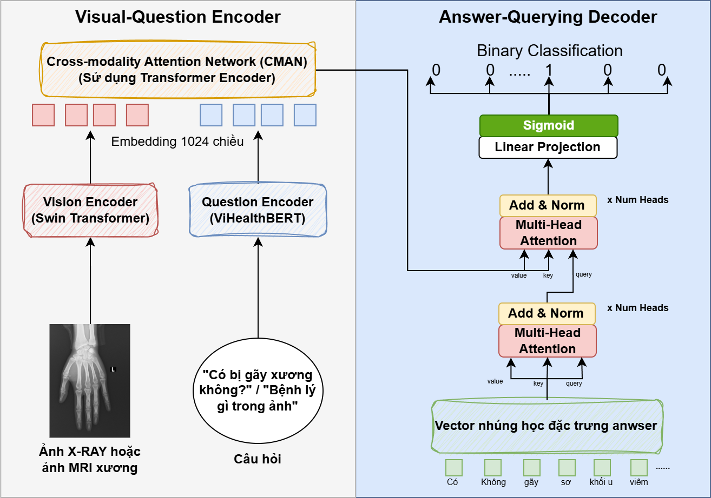

# BoneDiseaseVQA



BoneDiseaseVQA is a Medical Visual Question Answering (VQA) system designed to answer questions about bone disease using a combination of vision and language models. The system integrates a Swin Transformer for image encoding, ViHealthBERT for text encoding (Thanks Vietnamese reseach team for there excellent work on ViHealthBERT), and a cross-modality attention mechanism for fusion. To classified and generate the output, our team leverage the Answer-querying decoder (with a learnable answer embedding vector)

## Table of Contents
- [Overview](#overview)
- [Features](#features)
- [Installation](#installation)
- [Usage](#usage)
- [Training](#training)
- [Evaluation](#evaluation)
- [File Structure](#file-structure) 
- [Acknowledgments](#acknowledgments)

## Overview

BoneDiseaseVQA is a semi-open framework for Medical VQA tasks. It combines:
- **Swin Transformer** for vision encoding.
- **ViHealthBERT** for text encoding.
- **Cross-Modality Attention Network (CMAN)** for fusion.
- **Answer-querying decoder** for generating answers.

The model is trained on a dataset of medical images and corresponding questions, with labels mapped using `label_map_label2idx.json`.

## Features

- **Multi-modal Input**: Combines image and text data for VQA tasks.
- **Pretrained Models**: Utilizes pretrained Swin Transformer and ViHealthBERT for feature extraction.
- **Customizable Architecture**: Supports configurable embedding dimensions, fusion layers, and decoder layers.
- **Early Stopping**: Implements early stopping to prevent overfitting during training.

## Installation

1. Clone the repository:
   ```bash
   git clone https://github.com/Tuprott991/BoneDiseaseVQA-2
   cd BoneDiseaseVQA-2
   ```

2. Environment installation:
   ```bash
   pip install -r requirements.txt
   ```

3. Download the pretrained models and place them in the `project root` directory:
   - BoneDiseaseVQA weights (https://huggingface.co/Vantuk/BoneDiseaseVQA/tree/main)
   - Swin Transformer weights
   - ViHealthBERT weights

4. Ensure the dataset is prepared and placed in the `data` directory.

## Usage


To run web inference on a sample image and question, use the following command:
```bash
python gradio_infer.py
```

Upload your bone X-RAY/MRI image and ask for diagnose, also user can get more information about the diagnose via GPT-4o during the inference

## Training

To train the model, use the following command:
```bash
python train.py
```

Make sure your data is configure the same as my dataset.py -> This is dataloader format


## Acknowledgments

We would like to thank the developers of Swin Transformer and ViHealthBERT for their contributions to the open-source community. Special thanks to the medical professionals who provided insights and annotations for the dataset.
